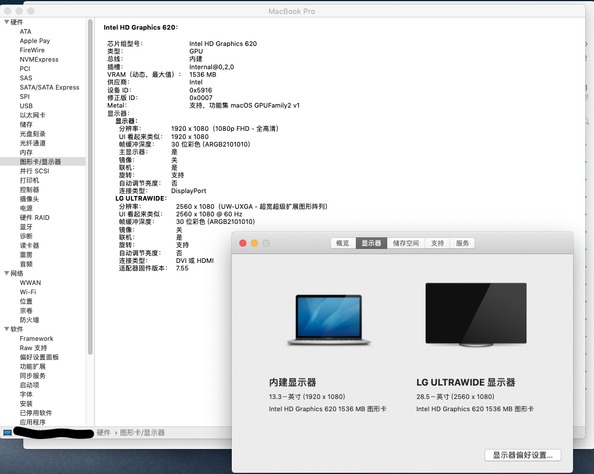

1. 电脑配置
  
   | 配置项   | 配置内容                                          | 备注                                                         |
   | -------- | ------------------------------------------------- | ------------------------------------------------------------ |
   | CPU      | i5-8250U                                          |                                                              |
   | 显卡     | Intel UHD Graphics 620                            |                                                              |
   | 声卡     | Realtek ALC3240 (ALC298)                          |                                                              |
   | 网卡     | AC3165                                            | 更换为DW1820A，1028:0023                                     |
   | 其他接口 | USB3.0 x 2，雷电3 x 1                             |                                                              |
   | 主板     | 2017年10月的那批，未缩水的配置，三星内存，三星SSD | 手贱血泪史※1 |
  
   ※1：手贱血泪史：
   - 2019/8/6 手贱，搞坏了电脑，送修后，更换了主板，缩水后的主板，海力士内存
   - 2019/8/19 再次手贱，尝试自己修改bios刷机，编程器刷进去后，开不了机，想再次刷回时发现刷不了了，再次售后维修，换回了三星内存主板
   - 2019/9/1 使用过程中发现换回的三星内存主板有问题，win10下关机不断电，而且很卡，娱乐大师跑分比之前少6W，然后又给换了海力士内存主板。。。

2. BIOS设置

   1. Load Default Settings
   2. OS Optimized Defaults -> false
   3. Intel Virtual Technology -> Disabled
   4. Intel Paltform Trust Technology -> Disabled
   5. Intel (R) SGX
      - Intel (R) SGX Control -> Software Controlled
   6. Boot Mode -> Legacy Support (不能设为UEFI模式，否则卡内存分配)

3. 驱动情况

   - [x] 显卡 - FB注入
   - [x] 声卡 - AppleALC，Layout-id : 22
   - [x] 网卡 - DW1820A，屏蔽针脚，隔空投送正常
   - [x] 触摸板 - VoodooI2C，参考官方说明，修改DSDT（搜索zhbchwin查看修改的地方）
   - [x] USB 3.0 - Hackintool，通过SSDT注入，未使用USBPorts
   - [x] 小太阳（亮度调节） - F11和F12键，修改DSDT（搜索zhbchwin查看修改的地方）
   - [ ] 雷电3 - 无雷电设备没法测试，但是USB已支持热插拔，睡眠唤醒也没问题，转接器外接HDMI显示器也OK
   - [x] HiDPI - 分辨率1080P，开启HiDPI后每次启动Logo都变大一下。。。
   - [x] 睡眠 - 正常（使用SSDT-GPRW.aml后，去掉网络唤醒，10个小时掉电4%）
   - [x] 变频 - 13档，1300-3400

4. 参考资料（感谢所有人）

   - 笔记本入手前的调查资料
      - [联想miix520 平板pc二合一 黑苹果macos10.14「逼近完美」](https://github.com/acai66/lenovo-miix-520-hackintosh-CLOVER)
      - [Yoga-730-hackintosh](https://github.com/dragonflylee/Yoga-730-hackintosh)
   - DSDT/SSDT (关键代码：iasl -da -dl *.aml)
      - [联合DSDT和SSDT进行反编译——减少DSDT和SSDT错误的尝试](http://bbs.pcbeta.com/viewthread-1475332-1-1.html)
   - 显卡
      - [[Guide] Intel Framebuffer patching using WhateverGreen](https://www.tonymacx86.com/threads/guide-intel-framebuffer-patching-using-whatevergreen.256490/)
      - [教程：利用Hackintool打开第8代核显HDMI/DVI输出的正确姿势](https://blog.daliansky.net/Tutorial-Using-Hackintool-to-open-the-correct-pose-of-the-8th-generation-core-display-HDMI-or-DVI-output.html)
   - USB定制
      - [Hackintool(原Intel FB-Patcher)使用教程及插入姿势](https://blog.daliansky.net/Intel-FB-Patcher-tutorial-and-insertion-pose.html)
   - 触控板
      - [GPIO Pinning](https://voodooi2c.github.io/#GPIO%20Pinning/GPIO%20Pinning)
      - [VoodooI2C触摸板驱动教程](https://www.penghubingzhou.cn/2019/01/06/VoodooI2C%20DSDT%20Edit/)
   - DW1820A驱动
      - [DW1820A(BCM94350ZAE) 的子型号说明和一些研究，19年5月发布](http://bbs.pcbeta.com/viewthread-1817694-1-1.html)
      - [DW1820A FOR 7490 - HELP](https://osxlatitude.com/forums/topic/11540-dw1820a-for-7490-help/)
   - 小太阳
      - [[教程] [授权翻译] 给DSDT/SSDT打补丁，实现笔记本亮度调节](http://bbs.pcbeta.com/viewthread-1571456-1-1.html)
      - [xps13 亮度调节](http://bbs.pcbeta.com/viewthread-1671644-1-1.html)
   - 雷电3
      - [USB热插拔 config.plist + SSDT-TYPC.dsl + SSDT-YTBT.dsl](https://github.com/the-darkvoid/XPS9360-macOS)
      - 转换器外接HDMI显示器（重启修复：@2，DP，pipe:12，0105）
        - [config_Kabylake_dp.plist(采用方案)](https://github.com/RehabMan/HP-ProBook-4x30s-DSDT-Patch/blob/05a1e82bf57559326f59d325fb9c4d04379e9ac5/config_parts/config_Kabylake_dp.plist#L16)
        - [[Guide] Intel IGPU HDMI/DP audio (all Sandy Bridge -> Kaby Lake [and likely later])](https://www.tonymacx86.com/threads/guide-intel-igpu-hdmi-dp-audio-all-sandy-bridge-kaby-lake-and-likely-later.189495/)
        - [0x591b0000, 0105 instead of 0306, HDMI](https://github.com/RehabMan/OS-X-Clover-Laptop-Config/blob/bcd876e93df197c1cbf04ba5923b5479f94988d4/config_HD615_620_630_640_650.plist#L349)
        - [[Guide] Enable Intel IGPU HDMI/DP Audio (Sandy/Ivy/Haswell/Broadwell/Skylake/Kaby Lake/Kaby Lake-R)](https://www.elitemacx86.com/threads/guide-enable-intel-igpu-hdmi-dp-audio-sandy-ivy-haswell-broadwell-skylake-kaby-lake-kaby-lake-r.186/)
   - HiDPI
      - [one-key-hidpi](https://github.com/xzhih/one-key-hidpi)
   - 其他
      - [Base64 在线解码、编码](https://the-x.cn/base64/)
      - 查看睡眠问题：`log show --last 1d | grep "Wake reason"`
      - [麦克风访问权限修复，手动修改TCC.db](https://appletoolbox.com/macbook-microphone-stopped-working-how-to-fix/#comment-1428198)
   
5. 其他

   - 雷电3驱动问题
      - BIOS版本: InsydeH20 Setup Utility Rev. 5.0
      - 感觉根BIOS设置有关，但是进不去`Advanced`设置项无法更改配置。
      - 想修改BIOS，无奈搜索资料不知道怎么改，而且风险也大。
      - 使用`setup_var`，`setup_var2`，`setup_var_3`均不能修改，要么`can't set variable using efi`，要么`offset is out of range`。
      - 可使用H20UVE修改
   - 惨痛经历
      - 可参看[手贱经历](手贱经历.md)，打算用编程器刷BIOS时，搞坏了电脑，维修时给换了主板，三星内存改成海力士了。。。
      - 之前的笔记本有过扩容内容后，无法开机，内存相关的dsdt信息有变，需要修改才行，而这次比较特殊，不修改dsdt居然可以进系统，保险起见，还是重新提取了dsdt，然后对比了一下内存相关信息确实有变，然后合并了过来，然后发现居然起不来了。。。又改回旧原来的dsdt才能进系统，有点出乎意料。。。
      - 再次售后维修后，换回三星内存主板，WiFi 5G也可以用了。。。
   
6. 截图

   1. 显卡

      

   2. 声卡

      

      

   3. WiFi

      

   4. 蓝牙 - 然而，貌似连上手机后一会就断开。。。

      

   5. 触控板

      

   6. USB

      

   7. 雷电3 - 使用`IOElectrify.kext`或`TbtForcePower.efi`后，如下图，然而并没有什么用，没设备测试。。点击关闭卡就直接重启了，所以暂且不用了。

      
	  
      通过雷电3转接器外接HDMI显示器：
	  
      

   8. 小太阳

      

   9. 变频
   
      

