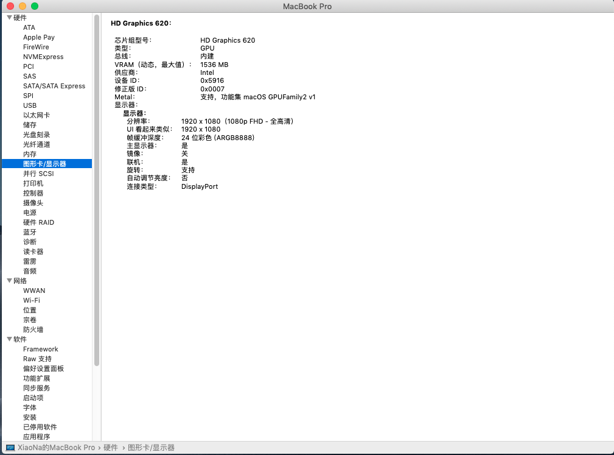
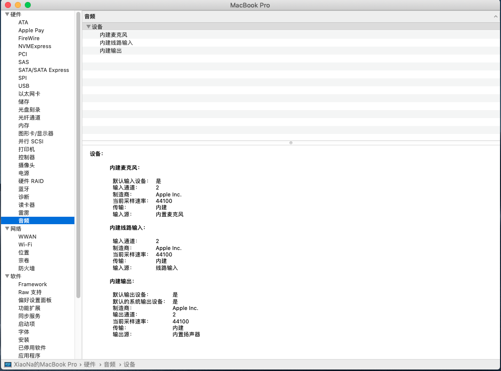
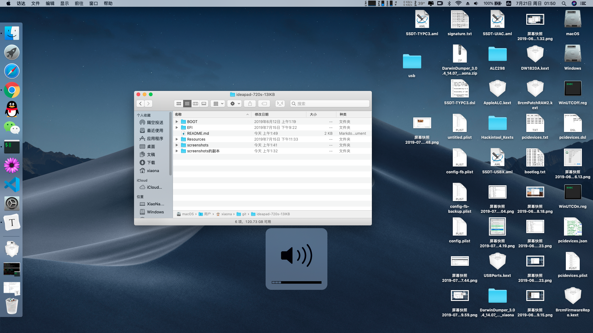
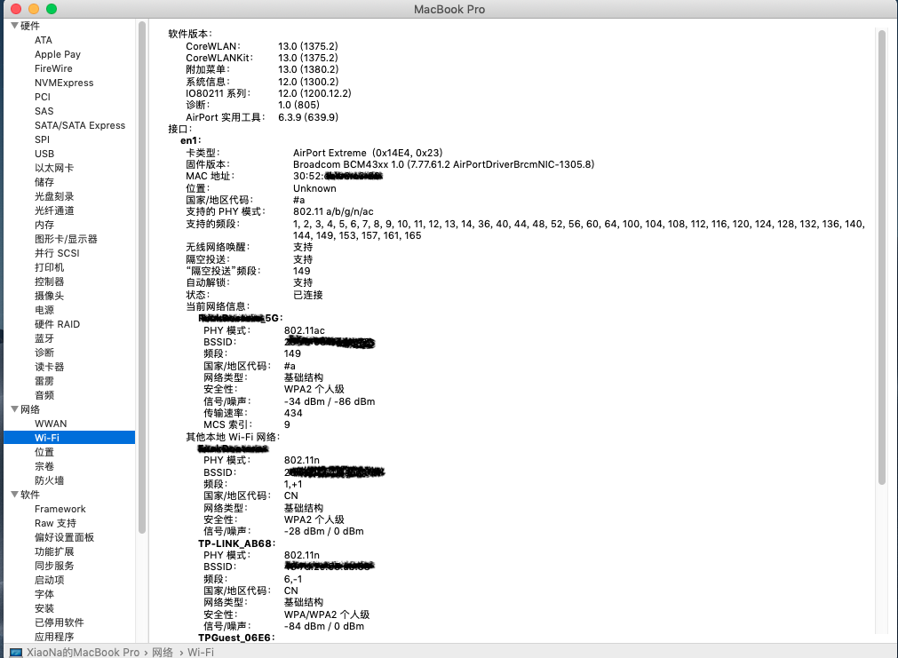
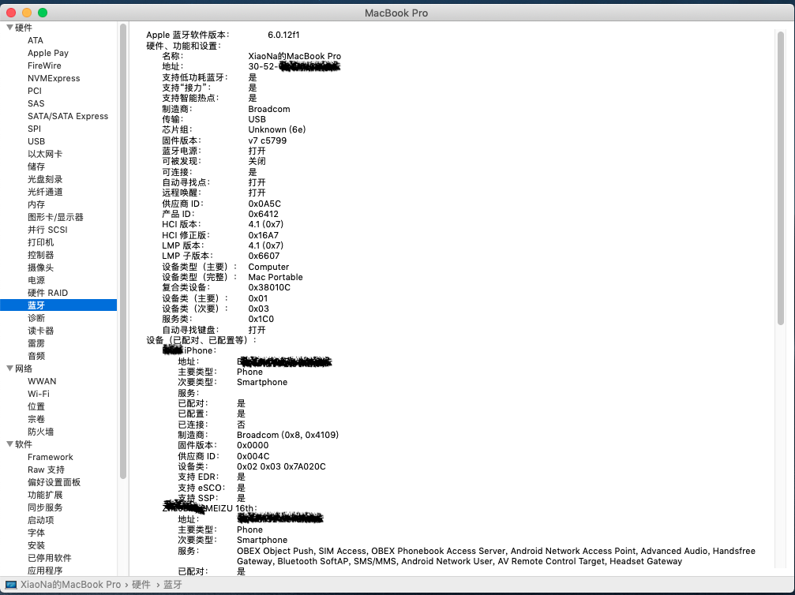
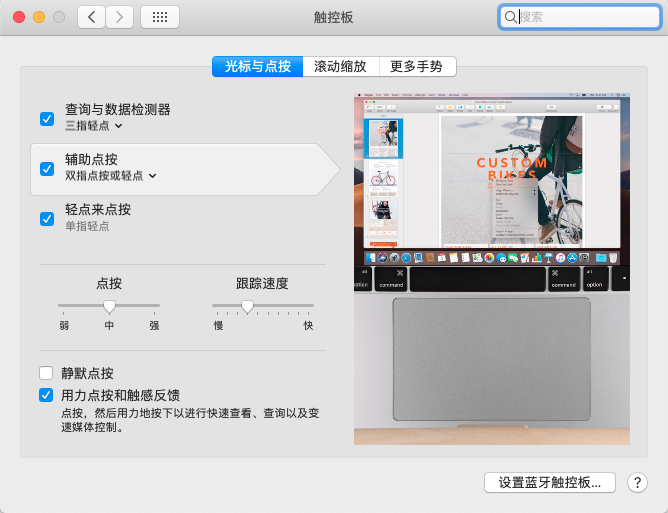
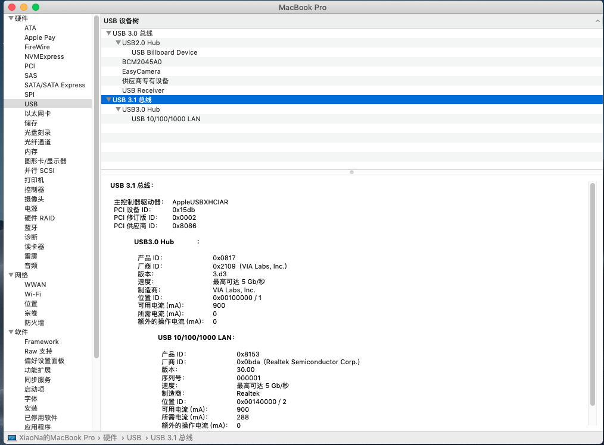
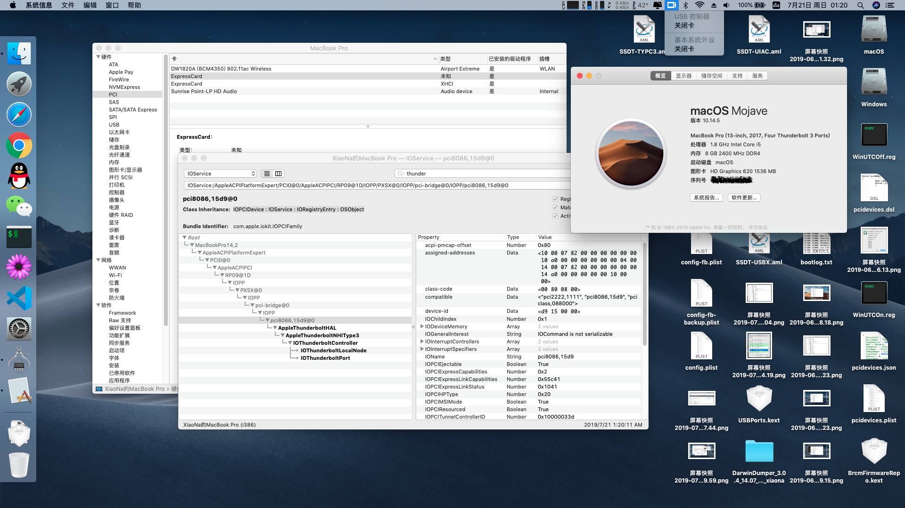
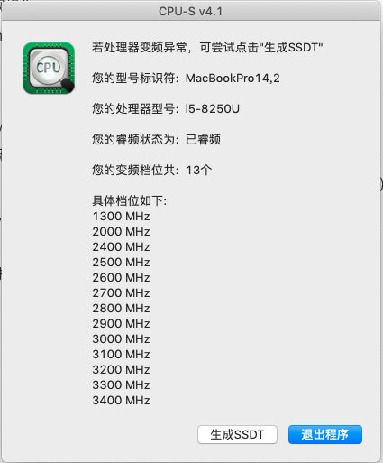

1. 电脑配置
  
   | 配置项   | 配置内容                 | 备注          |
   | -------- | ------------------------ | ------------- |
   | CPU      | i5-8250U                 |               |
   | 显卡     | Intel UHD Graphics 620   |               |
   | 声卡     | Realtek ALC3240 (ALC298) |               |
   | 网卡     | AC3265                   | 更换为DW1820A |
   | 其他接口 | USB3.0 x 2，雷电3 x 1    |               |
  
2. BIOS设置

   1. 按网上说的那样的常规操作
   2. 设置启动方式为Legacy Support，不能设为UEFI模式，否则卡内存分配。

3. 驱动情况

   - [x] 显卡 - FB注入
   - [x] 声卡 - AppleALC，Layout-id : 22
   - [x] 网卡 - DW1820A，屏蔽针脚，隔空投送正常
   - [x] 触摸板 - VoodooI2C，参考官方说明，修改DSDT（搜索zhbchwin查看修改的地方）
   - [x] USB 3.0 - Hackintool，通过SSDT注入，未使用USBPorts
   - [x] 小太阳（亮度调节） - F11和F12键，修改DSDT（搜索zhbchwin查看修改的地方）
   - [ ] 雷电3 - 待完善，USB已支持热插拔，睡眠唤醒也没问题，但外接HDMI显示器直接重启
   - [ ] HiDPI - 分辨率1080P，而且每次启动Logo都变大一下，所以未开启
   - [x] 睡眠 - 貌似正常
   - [x] 变频 - 13档，1300-3400

4. 参考资料（感谢所有人）

   - 笔记本入手前的调查资料
      - [联想miix520 平板pc二合一 黑苹果macos10.14「逼近完美」](https://github.com/acai66/lenovo-miix-520-hackintosh-CLOVER)
      - [Yoga-730-hackintosh](https://github.com/dragonflylee/Yoga-730-hackintosh)
   - DSDT/SSDT (关键代码：iasl -da -dl *.aml)
      - [联合DSDT和SSDT进行反编译——减少DSDT和SSDT错误的尝试](http://bbs.pcbeta.com/viewthread-1475332-1-1.html)
   - 显卡
      - [[Guide] Intel Framebuffer patching using WhateverGreen](https://www.tonymacx86.com/threads/guide-intel-framebuffer-patching-using-whatevergreen.256490/)
      - [教程：利用Hackintool打开第8代核显HDMI/DVI输出的正确姿势](https://blog.daliansky.net/Tutorial-Using-Hackintool-to-open-the-correct-pose-of-the-8th-generation-core-display-HDMI-or-DVI-output.html)
   - USB定制
      - [Hackintool(原Intel FB-Patcher)使用教程及插入姿势](https://blog.daliansky.net/Intel-FB-Patcher-tutorial-and-insertion-pose.html)
   - 触控板
      - [GPIO Pinning](https://voodooi2c.github.io/#GPIO%20Pinning/GPIO%20Pinning)
      - [VoodooI2C触摸板驱动教程](https://www.penghubingzhou.cn/2019/01/06/VoodooI2C%20DSDT%20Edit/)
   - DW1820A驱动
      - [DW1820A(BCM94350ZAE) 的子型号说明和一些研究，19年5月发布](http://bbs.pcbeta.com/viewthread-1817694-1-1.html)
      - [DW1820A FOR 7490 - HELP](https://osxlatitude.com/forums/topic/11540-dw1820a-for-7490-help/)
   - 小太阳
      - [[教程] [授权翻译] 给DSDT/SSDT打补丁，实现笔记本亮度调节](http://bbs.pcbeta.com/viewthread-1571456-1-1.html)
      - [xps13 亮度调节](http://bbs.pcbeta.com/viewthread-1671644-1-1.html)
   - 雷电3
      - [USB热插拔 config.plist + SSDT-TYPC.dsl + SSDT-YTBT.dsl](https://github.com/the-darkvoid/XPS9360-macOS)
   - HiDPI
      - [one-key-hidpi](https://github.com/xzhih/one-key-hidpi)
   - 其他
      - [Base64 在线解码、编码](https://the-x.cn/base64/)
   
5. 其他

   - 雷电3驱动问题
      - BIOS版本: InsydeH20 Setup Utility Rev. 5.0
      - 感觉根BIOS设置有关，但是进不去`Advanced`设置项无法更改配置。
      - 想修改BIOS，无奈搜索资料不知道怎么改，而且风险也大。
      - 使用`setup_var`，`setup_var2`，`setup_var_3`均不能修改，要么`can't set variable using efi`，要么`offset is out of range`。
   - 其他的其他
   
6. 截图

   1. 显卡

      

   2. 声卡

      

      

   3. WiFi

      

   4. 蓝牙 - 然而，貌似连上手机后一会就断开。。。

      

   5. 触控板

      

   6. USB

      

   7. 雷电3 - 使用IOElectrify.kext后，如下图，然而并没有什么用，接HDMI显示器直接重启。。。

      

   8. 小太阳

      

   9. 变频

      

